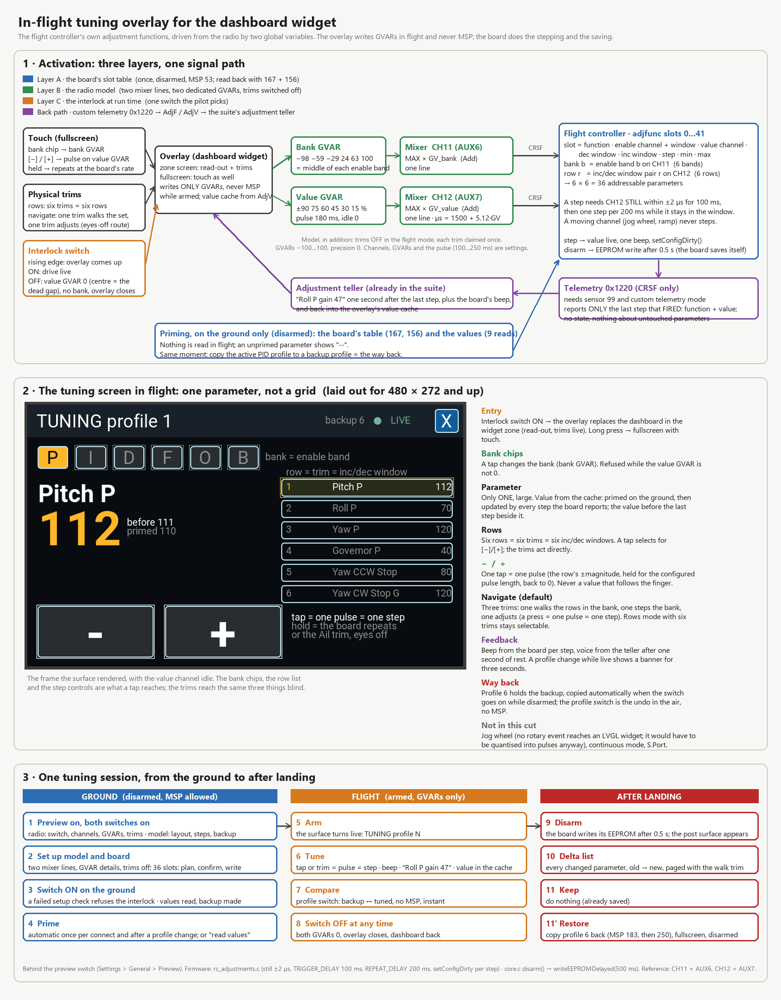
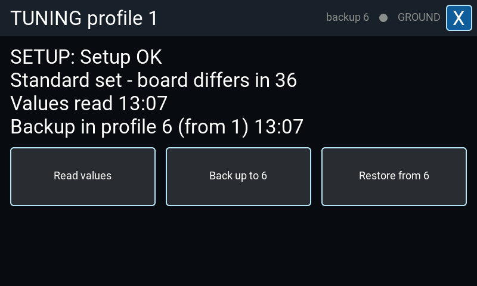
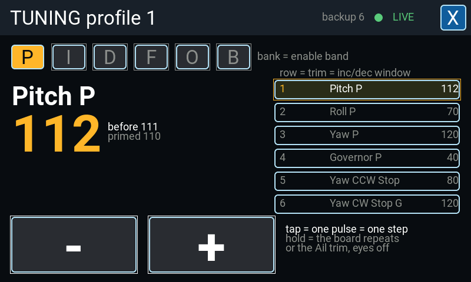
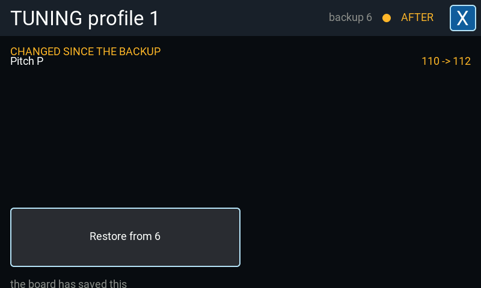

# In-flight tuning overlay

A surface the dashboard widget puts in front of the theme while a switch is on, so that the
flight controller's own adjustment functions can be driven from the air without a menu.

It is a **preview feature**: it is hidden until *System* → *Settings* → *General* →
*Preview* → *In-flight tuning* is switched on, and switching it on asks first. It changes the
flight controller's parameters in flight.

## What it drives, and what it does not

The overlay never speaks MSP in the air. Everything it does while the model is armed is a
write to two EdgeTX global variables, which two mixer lines put on two channels; the flight
controller's own adjustment functions do the stepping, the beeping and the saving. That is
what makes it work while armed at all — the suite's MSP queue is cleared on every armed tick,
so anything that needed a reply would simply be dropped.

MSP is used on the ground only, and refused while the board is armed, while the rotor is
turning, and while the arm state has not been read at all.

## Setting it up

Two pages, one for each half:

- [*System* → *Settings* → *Dashboard* → *In-Flight Tuning*](../pages/settings/dashboard/inflight.md)
  — the radio's half: the master switch, the interlock switch, the channels, the variables,
  the pulse length and the trims. It carries **Set up the model**, which writes the mixer
  lines, the variable details and the trim modes after showing what it would change.
- [*Configuration* → *Setup* → *Controls* → *In-Flight Tuning*](../pages/setup/controls/inflight.md)
  — the flight controller's half: the model's own switch, the set layout, the step sizes and
  the backup PID profile. It carries **Set up the flight controller**, which writes the
  adjustment slots after showing what each one holds now.

Both switches have to be on, and the model's setup check has to pass: a fault refuses the
interlock rather than letting a press move a parameter other than the one on the screen.

## The three surfaces

The interlock switch is the only way in, and what it shows follows the flight rather than the
switch.

### On the ground, before the flight

The setup check's verdict, how the board's own slots compare with the set, when the values
were last read, and where the backup sits. Its three actions are *Read values*, *Back up to
&lt;profile&gt;* and *Restore from &lt;profile&gt;*.

Values are read here and nowhere else: the receiver map, the board's adjustment slot table,
and nine reads that between them answer every parameter of the set. It happens by itself once
per connect and after a profile change, or on demand. A parameter that has never been read
shows `--` in the air rather than a number nobody measured.

Arming during a read gives that read up — nothing may be sent to a machine in the air — and
the line keeps reporting the values it already has, with the time they were read at and a note
that the attempt to read them again was interrupted. The read is taken again by itself on the
ground; the values already in the cache are not thrown away by an attempt that did not
replace them.

The backup is taken by itself when the interlock goes on with the machine on the ground, the
link up and the values read. It is **one slot and it belongs to the profile it was copied
from**: change the PID profile on the ground and a fresh copy of the new profile is taken, and
the line under the buttons names the profile it came from. That replaces the previous
profile's undo, which is what one slot means. When the backup was copied from a profile other
than the one being flown the line says so, and the restore refuses until the pilot has
switched back to it — a copy put back over another profile would overwrite values he never
flew there. A backup whose source is not known at all — the record is kept in memory, so a
restart leaves the slot holding a copy of something — is refused for the same reason.

### In the air

One parameter at a time, not a grid:

- **The bank chips** across the top choose which of the six banks the enable channel sits in.
  A tap is refused while a step is still on the wire.
- **The parameter**, large, with the value it had before the last step and the value it was
  primed with. The value comes from the cache: read on the ground, then kept current by every
  step the flight controller reports back over its adjustment telemetry. The surface updates
  those numbers in place -- a step never rebuilds the screen, so the board's answer to a press
  cannot arrive at the cost of the pass that ends the pulse.
- **The row list** on the right is the six rows of the bank. A tap selects the row the step
  controls act on; the trims act on them directly.
- **The step controls** at the bottom. One tap is one pulse is one step. Held, the flight
  controller repeats at its own rate. There is never a value that follows the finger.
- **The trims** do the same thing without looking down, in whichever of the two layouts the
  radio is set to.

A profile change while the surface is live is named on the screen, and every cached value
belonging to that profile is marked unknown until the reads have been sent again.

In the widget's own zone the same surface is a read-out with the trims live; a long press
opens it fullscreen, where the touch controls are.

### After landing

Every parameter that has left the backup, largest change first, old to new, paged with the
trim that walks the parameters in the air. There is nothing to save: the flight controller
writes its own storage shortly after disarm. The one action is the restore.

If the backup was copied from another profile than the one now active, there is no comparison
to make: the board's adjustments only ever moved the active profile, so the two lists would
differ by everything the two profiles disagree about. The surface says which profile the
backup is from and which one is active instead of listing that as something the flight
changed.

## Notes

- The way back in the air is the PID profile switch, not the overlay: the backup profile
  holds what the flight started from, so switching to it is instant and needs no MSP.
- **Releasing the interlock on the ground ends the tuning session.** The read, the backup line
  and the comparison go with it, and the next closing of the interlock reads the board again
  and lays down a fresh backup of whichever profile is active then. Releasing it *in the air*
  ends nothing: nothing can be sent to a flying machine, and the comparison the landing is
  about to show is measured against a snapshot that has to survive the switch. What the new
  read costs is the nine value reads and not the whole slot table — a layout does not change
  because a switch moved.
- Releasing the interlock, closing the fullscreen, backgrounding the widget or losing the
  link all take the value variable back to zero, in the flight mode it was written in, and
  end whichever of the three surfaces was up. The next opening of the interlock is an opening
  again, with the undo it asks for. Those four take the bank variable back to zero as well;
  landing does not, because the surface is still up and still showing that bank.
- The rate and PID profile are two of the parameters the set can carry, and they are counted
  from 1 wherever they appear — the header, the backup line, and their own rows.
- On an ExpressLRS link use the *Wide* switch mode or a full-resolution packet rate: in
  *Hybrid* mode the two channels carry 16 and 6 positions, and several of the windows the
  flight controller decodes are missed.
- The spoken confirmation of a step is the suite's existing adjustment announcement, switched
  under *System* → *Settings* → *Audio* → *Events* → *Adjustments*.

## Related

- [Rotorflight documentation](https://www.rotorflight.org/docs/) — the adjustment functions
  themselves: what each one changes, its range, and how the slots are addressed.
