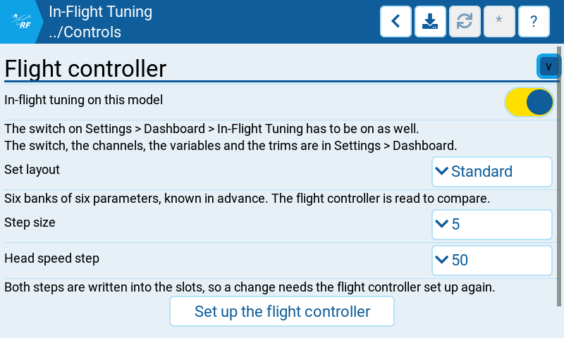
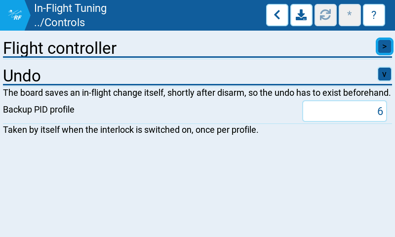

# In-Flight Tuning

The flight controller's half of the in-flight tuning overlay: which parameters this machine
offers, how far one press moves them, and which PID profile is the way back. These settings
are stored with the model, so they travel with the helicopter. The switch, the channels, the
variables and the trims belong to the radio and are on the other page,
*System* → *Settings* → *Dashboard* → *In-Flight Tuning*.

**Both switches have to be on before anything drives.** The radio's is the master: with it
off nothing happens on any model. The one here says this machine is set up for the overlay.

## Where to find it

*Configuration* → *Setup* → *Controls* → *In-Flight Tuning*

Hidden until *System* → *Settings* → *General* → *Preview* → *In-flight tuning* is on.
Greyed out until the flight controller answers. Read-only while the model is armed.

## Settings

### Flight controller

| Setting | What it does |
| --- | --- |
| In-flight tuning on this model | The model's own switch. Off by default, and the radio's master switch has to be on as well. |
| Set layout | *Standard* (default): six banks of six parameters, the layout the generic radio setup documents. The board's own slot table is read and held against it, so the page can say where the two differ. *Custom*: the set is whatever the board carries, derived from the enable and increment windows of the slots on this model's channels — nothing is ever written to it. |
| Step size | What one press moves a parameter by, in the flight controller's own units. 1, 2, 5 or 10; default 5. |
| Head speed step | The same, for the governor head speed alone. 10, 25, 50 or 100; default 50. It has a step of its own because its range is 0 to 10000 rpm where no other parameter of the set is bounded above 250. |
| Set up the flight controller | Reads the board in two replies, shows what each slot holds and what it would hold, writes one adjustment range per slot once that is confirmed, follows it with a single EEPROM write, and reads every written slot back field by field against the set it was asked for, both step sizes included. Offered in the *Standard* layout only: in *Custom* the set is what the board carries, and writing it would overwrite the very thing being read. |

Both steps are written into the slots, so changing one means setting the flight controller up
again. The board comparison reports that by name.

The read-back after a write holds each slot against the record the write was built from, the two
step sizes among the fields it compares. Where a slot holds the right function on the right
channels and only the step disagrees — a flight controller that took the record and kept a step of
its own — the page says so instead of counting differing slots, since the step is the one field of
a slot these settings decide.

### Undo

The board saves an in-flight change itself, shortly after disarm, so the undo has to exist
beforehand.

| Setting | What it does |
| --- | --- |
| Backup PID profile | The profile the flying one is copied into before a flight, and restored from after it. 0 to 6, where 0 is none; default 6. A board with fewer profiles has the choice refused by name. |

The backup is taken by itself when the interlock is switched on with the machine on the
ground, the link up and the values read — once per profile.

## Notes

- Nothing on this page is written to the flight controller by saving. The one thing that
  writes it is *Set up the flight controller*, and it asks first.
- Saving reports its outcome in the suite's own save overlay. These settings are stored with
  the model and keyed by the flight controller's MCU id, so a save made without one, or one the
  card refused, is named rather than passed over.
- The profile switch is the undo in the air: the backup profile holds what the flight started
  from, so switching to it is instant and speaks no MSP. A restore into a profile other than
  the one the backup was taken from is refused.

## Related

- [In-flight tuning overlay](../../../dashboard/inflight-tuning.md) — what the surface does in
  the air.
- *Configuration* → *Setup* → *Controls* → *Adjustments* — the same adjustment slots,
  edited one at a time.
- [Rotorflight documentation](https://www.rotorflight.org/docs/) — the adjustment functions
  themselves, their ranges and what each one does to the helicopter.

*Documented against RFSuite 0.1.7.*
